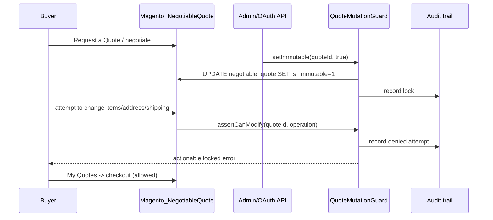

# Immutable Quote System Architecture

## Executive summary

`Logiscenter_ImmutableQuote` adds an auditable, API-only immutability lock on top of Adobe
Commerce B2B's native Negotiable Quote workflow (Request for Quote, **My Quotes**, checkout).
It does not create a parallel quote system, a parallel API, or a parallel frontend: it decorates
`Magento_NegotiableQuote` with one boolean flag, one centralized mutation policy, domain events,
an audit trail, caching and rate limiting.

This revises an earlier draft of this module that built a standalone quote type with its own
account controllers, block and API. That duplicated functionality Adobe Commerce already ships
(listing, activation, checkout) and would have produced two divergent "quote" concepts for the
same business object. The superior design is to extend the B2B quote Magento already extended.

## Data-model decision: extend the native quote extension table

`Magento_NegotiableQuote` already solved the "quote metadata" problem for B2B by adding a single
`negotiable_quote` table (1:1 with `quote`, via `quote_id`) instead of a micro-table per feature
(status, pricing, snapshot, creator, etc. all live there). This module adds three columns to that
same table via declarative schema: `is_immutable`, `immutable_locked_by`, `immutable_locked_at`,
following the exact pattern Magento's own `Magento_GiftMessage` module uses to add
`gift_message_id` to `quote`/`sales_order` (a module extending a table it does not own, whitelisted
in its own `db_schema_whitelist.json`).

**Why not a new micro-table (the pattern this test's brief warns against):** `negotiable_quote` is
already loaded on every negotiable-quote read (native extension attribute join on `CartInterface`).
Storing the lock there costs **zero additional JOINs or queries** — the alternative (a
`logiscenter_quote_extension` table keyed by `quote_id`) would have been exactly one more
micro-table added to the very inventory this test criticizes (6–8 tables for expiration, T&Cs,
custom fees, etc.), each requiring its own JOIN to assemble a full quote.

**Why not a fully independent quote system:** it would have required reproducing
status transitions, comments, history, email notifications, and checkout/order conversion that
Magento_NegotiableQuote already implements and Adobe Commerce documents in
["Request for quote"](https://experienceleague.adobe.com/en/docs/commerce-admin/b2b/quotes/quote-request).

### Trade-offs and migration

Extending a table owned by another module means `Logiscenter_ImmutableQuote` must declare a
`module.xml` sequence on `Magento_NegotiableQuote` and keep its whitelist in sync on Adobe Commerce
B2B upgrades. This is a well-established, supported Magento pattern (not a core hack): declarative
schema merges additively, and the module can be disabled without breaking `negotiable_quote`
(columns simply become unused). No data migration is required for new installs; for retrofitting
onto an existing B2B catalog, `is_immutable` defaults to `0`, so every existing negotiable quote
starts mutable and is opted into immutability only through the API described below.

## Patterns and boundaries

* **Repository** — `ImmutableQuoteRepository` implements `get`, `getList` (with `SearchCriteria`),
  `save` and `delete`/`deleteById`. `save`/`delete` only ever write the three lock columns (Magento's
  `AbstractResource::_prepareDataForTable()` includes only fields explicitly set on the model), so
  every other Negotiable Quote column — status, pricing, snapshot — is left untouched. `delete`
  means *unlock*, never a `DELETE` against `negotiable_quote`: that row is owned by
  `Magento_NegotiableQuote`.
* **Service/Application layer** — `ImmutableQuoteManagement` exposes exactly two use cases,
  `setImmutable()` and `get()`. It asserts the target is a real Negotiable Quote via
  `NegotiableQuoteRepositoryInterface::getById()` before touching the lock.
* **Policy/Guard** — `QuoteMutationGuard` centralizes the immutable decision, the error message and
  the audit call. Every plugin is a thin adapter delegating to this one guard; none re-implements
  `isImmutable()`.
* **Domain event object** — `ImmutableQuoteEvent` is dispatched as
  `logiscenter_immutable_quote_locked` / `_unlocked`. Consumers can add ERP sync, webhooks or
  notifications without editing this module.
* **Cache-aside** — `ImmutableQuoteCache` has a request-local identity cache and a five-minute
  application cache. Repository writes invalidate both.
* **Extension attribute + checkout config** — `CartExtensionAttributePlugin` lifts `is_immutable`
  onto `CartInterface` (via `etc/extension_attributes.xml`), so any API consumer reading a quote/cart
  sees the lock directly. `ImmutableQuoteConfigProvider` mirrors the same flag into
  `window.checkoutConfig.logiscenterIsImmutableQuote` for future frontend use.
* **My Quotes grid column** — `NegotiableQuoteGridDataPlugin` (an `afterGetData` plugin on
  `Magento\NegotiableQuote\Ui\DataProvider\DataProvider`) attaches `is_immutable` to each grid row,
  and `view/frontend/ui_component/negotiable_quote_listing.xml` merges an "Immutable" column
  (`Model\Source\ImmutableStatus`) into the native grid — no duplicate listing is created.

### Why the guard never touches the raw `Quote` model

An earlier iteration also plugged `Magento\Quote\Model\Quote::addItem/removeAllItems/
setBillingAddress/setShippingAddress` directly. That broke checkout: Magento_NegotiableQuote
rebuilds a scratch, in-memory "snapshot" quote for **My Quotes** history/grid rendering by calling
`$quote->removeAllItems()` on an unrelated in-memory object that happens to share the locked
quote's ID — with no persistence involved. The guard fired anyway and broke "Send for review" and
"Proceed to Checkout". The fix was to guard **only the customer/API-facing service layer**
(`Quote\Item\Repository`, `CouponManagement`, `BillingAddressManagement`,
`ShippingInformationManagement`, `ShippingMethodManagement`, `QuoteRepository::save`), which
internal snapshot/recalculation code never calls.

### Idempotent resubmission vs. a real edit

Magento's own checkout resubmits the already-negotiated billing/shipping address and shipping
method as part of normal step progression, and recalculates item price/tax on "Proceed to
Checkout" and "Send for review" without changing quantities. A guard that blocks unconditionally
breaks those flows. `AddressComparator` (address/shipping-method fields) and a `qty`
`dataHasChangedFor()` check (`CartItemRepositoryPlugin`) let the policy distinguish:

| Boundary | Blocked | Allowed |
|---|---|---|
| `Quote\Item\Repository::save()` | new item, or existing item's `qty` changed | price/tax-only refresh of an unchanged `qty` |
| `BillingAddressManagement::assign()` | a field actually differs from the stored address | resubmitting the identical address (Magento always creates a new `address_id`, so an ID-based diff would misfire here) |
| `ShippingInformationManagement::saveAddressInformation()` | shipping/billing address or method actually differs | resubmitting the identical address + method |
| `ShippingMethodManagement::set()` | a different carrier/method code | reselecting the already-set method |
| `Quote\Item\Repository::deleteById()`, `CouponManagement::set/remove` | always | never (no legitimate resubmission case) |
| `QuoteRepository::save()` | `coupon_code` or `customer_note` changed (`dataHasChangedFor`) | everything else (status transitions, totals collection, order placement) |

## Who can set the flag, and when

The flag is **never** set implicitly: not by customer/company role, not automatically when a
Request for Quote is created. A quote is created and negotiated exactly as Adobe Commerce
documents; only an authorized administrator or integration can subsequently lock it via
`PUT /V1/logiscenter/negotiable-quotes/:quoteId/immutable`, gated by the
`Logiscenter_ImmutableQuote::set_immutable` ACL. This keeps company buyer/purchasing-agent roles
(company ACL) and the immutability decision (module ACL) as two independent concerns, so granting
a role permission to request quotes never implies permission to lock them.

## Mutation and checkout flow

Checkout and order conversion are never blocked: the guard only refuses the specific write
boundaries listed in the brief (items, quantities, addresses, shipping method, coupons).

## Security and observability

REST routes require one of two granular admin ACLs: `view` or `set_immutable`. Adobe Commerce
OAuth integrations and admin tokens use normal Web API authorization. All inputs are typed; quote
IDs are validated before use; resource models and repositories use Magento DB abstractions and
parameterized persistence.

The configurable default rate is 100 requests/hour per authenticated principal *and operation*.
The cache-keyed fixed window is sufficient for one application node; multi-node production should
point Magento cache at Redis and use an atomic `INCR` Lua implementation for strict limits. Audit
entries record actor, type, IP, action, result and safe JSON context in a separate table and
`var/log/b2b_immutable_quote.log` through PSR-3. Secrets, tokens, addresses and cart item data are
never logged.

## Performance and limitations

There is no N+1 operation for a single quote decision: repeated decisions in one request use
memory, cross-request lookups use the cache, and the lock read itself costs no extra JOIN because
it lives on the row Magento already loads. `getList()` restricts the selected columns to the lock
projection instead of pulling the full `negotiable_quote` row (snapshot, pricing, etc.).

Direct database writes and third-party code that bypasses Magento services cannot be prevented; DB
permissions and integration review are required. Rate-limit increment is not strictly atomic on
every cache backend, as noted above.

A storefront-side visual lock (disabling the checkout shipping/address step, `is_customer_price_
changed`-style badges) was attempted via a `Magento_Checkout` `LayoutProcessor` and reverted: setting
a component's `visible` flag broke the `deps`-based dependency graph other checkout components
(progress bar, totals, third-party payment shipping-information widgets) rely on to know the
shipping step has rendered, causing unrelated template-loading failures across the whole page. The
`is_immutable` flag is already available to checkout JS via `ImmutableQuoteConfigProvider`
(`window.checkoutConfig.logiscenterIsImmutableQuote`) for a future, carefully browser-tested
frontend pass; until then, the API/service-layer guard is the sole and authoritative enforcement
mechanism, matching this test's guidance to prioritize backend correctness over frontend polish.